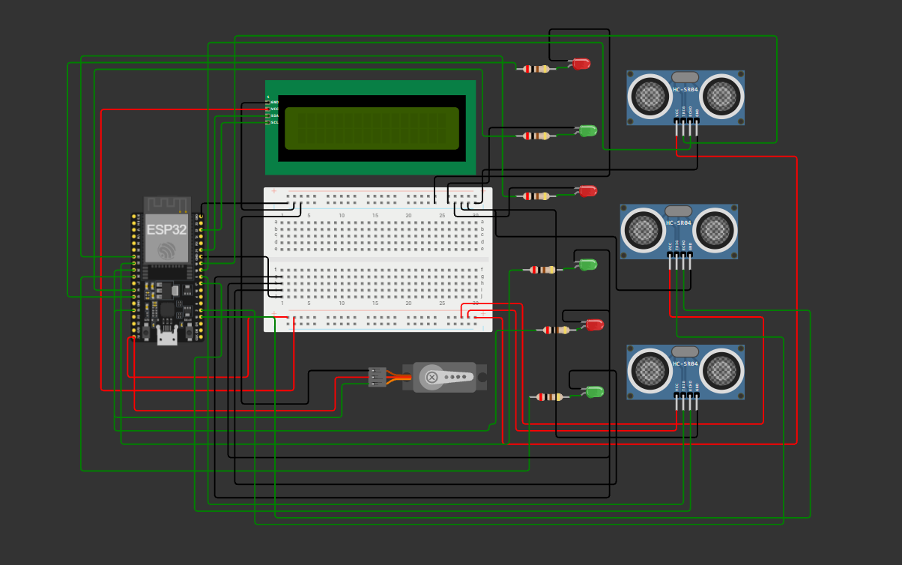

# ESP32 Smart Parking System

A smart parking system using **ESP32**, **HC-SR04 ultrasonic sensors**, **LED indicators**, a **16x2 I2C LCD**, and a **servo motor**. It monitors three parking slots and automatically controls the entrance gate based on slot availability.

## Features

* 3 parking slots
* Ultrasonic-based vehicle detection
* Red/green LED status indication
* 16x2 I2C LCD display
* Automatic servo gate control
* Available-slot counting
* Serial Monitor status output

## Components

| Component                 | Quantity |
| ------------------------- | -------: |
| ESP32                     |        1 |
| HC-SR04 Ultrasonic Sensor |        3 |
| Red LED                   |        3 |
| Green LED                 |        3 |
| 200 Ω Resistor            |        6 |
| Servo Motor               |        1 |
| 16x2 I2C LCD              |        1 |
| Breadboard & Jumper Wires |        — |

## Pin Connections

| ESP32 Pin    | Component       |
| ------------ | --------------- |
| GPIO 19      | TRIG 1          |
| GPIO 18      | ECHO 1          |
| GPIO 2       | TRIG 2          |
| GPIO 15      | ECHO 2          |
| GPIO 5       | TRIG 3          |
| GPIO 17      | ECHO 3          |
| GPIO 14 / 27 | Green 1 / Red 1 |
| GPIO 33 / 32 | Green 2 / Red 2 |
| GPIO 26 / 25 | Green 3 / Red 3 |
| GPIO 13      | Servo           |
| GPIO 21      | LCD SDA         |
| GPIO 22      | LCD SCL         |

## Circuit Diagram



## Working

Each HC-SR04 sensor measures the distance to a vehicle.

```text
Distance < 20 cm → OCCUPIED
Distance ≥ 20 cm → FREE
```

* **Green LED** → Slot available
* **Red LED** → Slot occupied
* **Available slots > 0** → Gate opens
* **Available slots = 0** → Gate closes

The LCD displays the status of all three slots and the number of available slots.

Example:

```text
S1:FREE S2:OCC
S3:FREE

Available: 2/3
Gate: OPEN
```

## Applications

* College parking
* Office parking
* Apartment parking
* Smart city parking systems

## Future Improvements

* Wi-Fi-based parking monitoring
* Mobile application
* RFID vehicle identification
* Parking reservation
* Cloud data storage

## Author

**Project:** ESP32 Smart Parking System
**Platform:** Arduino IDE / Wokwi
**Microcontroller:** ESP32
**Created:** August 2026
